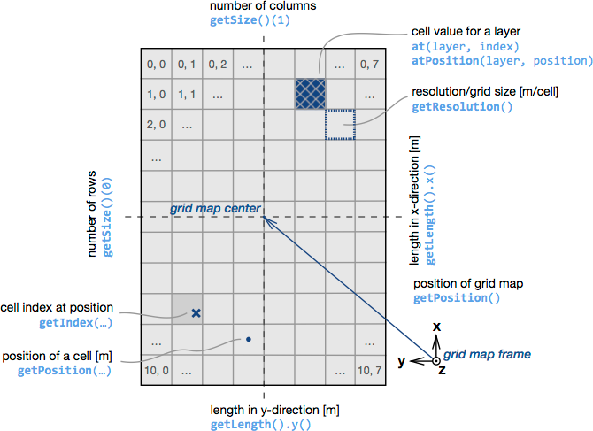
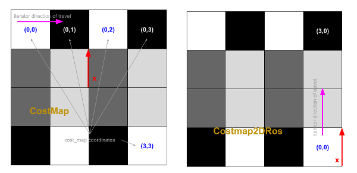
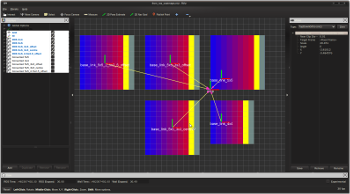
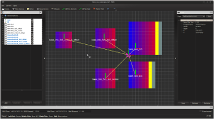
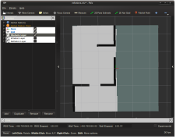
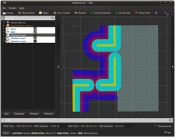

# Cost Map

This is a C++ library directly analogous to ETHZ ASL's [GridMap] library,
but designed for use with costs where the data element is a byte (as opposed to grid_map's doubles).

## Table of Contents

1. [Packages Overview](#packages-overview)
2. [Conventions & Definitions](#conventions-and-definitions)
3. [Image Bundles](#image-bundles)
4. [Costmap2DROS Conversions](#costmap2dros-conversions)
5. [Other Conversions](#other-conversions)
6. [Inflation Computers](#inflation-computers)

## Packages Overview

* ***cost_map*** : meta-package for the grid map library.
* ***cost_map_core*** : core interfaces and algorithms of the cost map library, this package has no [ROS] dependencies.
* ***cost_map_ros*** : converters and utilities for cost maps in a [ROS] ecosystem - Image Bundles, CostMap2DROS, OccupancyGrid, CostMap messsages.
* ***cost_map_cv*** : conversions from and to [OpenCV] image types.
* ***cost_map_msgs*** : [ROS] message definitions related to the [cost_map_msgs/CostMap] type.
* ***cost_map_visualisations*** : helper nodes that bridge cost maps to [RViz].
* ***cost_map_demos*** : several nodes for demonstration purposes and a test suite.

The source code is released under a [BSD 3-Clause license](LICENSE).

## Conventions and Definitions

The core api is designed to maintain as close a compatibility to grid maps as possible. As such, all grid map conventions
and definitions apply - an illustrative reference of these is provided as a convenience below. For further detail,
please refer to the [GridMap README](https://github.com/ethz-asl/grid_map/blob/master/README.md).

[](cost_map_core/doc/grid_map_layers.pdf)

[](cost_map_core/doc/grid_map_conventions.pdf)

## Image Bundles

### About

Image bundles allow for an easy way to load/save cost map information from/to files on disk. This
data is stored in two parts - 1) meta-information about the costmap in a yaml file and
2) layer data that is stored alongside in grayscale images. 

A typical meta yaml for an image bundle:

```yaml
# frame in the world that this map is attached to
frame_id: map
# co-ordinates of the centre of the map relative to the frame_id
centre_x: 0
centre_y: 0
# dimensional properties of the map
resolution: 0.05
number_of_cells_x: 200
number_of_cells_y: 200
# data layers
layers:
  - layer_name: obstacle_costs
    layer_data: obstacle_costs.png
  - layer_name: static_costs
    layer_data: can_be_some_other_name.png
```

See [cost_map_ros/image_bundles/example.yaml](https://github.com/stonier/cost_map/blob/devel/cost_map_ros/image_bundles/example.yaml) for a real example.

### ImageBundle Demo

```bash
# load an image bundle and visualise the cost map
roslaunch cost_map_demos load_image_bundle.launch --screen
```

### ImageBundle Command Line Utilities

There exist two command line utilities for loading and saving to and from a cost map topic:

```bash
# load and publish to '/foo/cost_map'
rosrun cost_map_ros load_image_bundle -t /foo/cost_map example.yaml
# subscribe and save from '/foo/cost_map' to foo.yaml
mkdir foo
cd foo
rosrun cost_map_ros save_image_bundle /foo/cost_map foo.yaml
```

### ImageBundle Methods

* `cost_map::toImageBundle()` : convert a `cost_map::CostMap` object to an image bundle
* `cost_map::fromImageBundle()` : load an image bundle into a `cost_map::CostMap` object

See the [LoadImageBundle/SaveImageBundle](https://github.com/stonier/cost_map/blob/devel/cost_map_ros/src/lib/image_bundles.cpp)
classes which illustrate how the command line utilities use these api.

## Costmap2DROS Conversions

The ROS Navistack uses `costmap_2d::Costmap2DROS` objects and it is sometimes necessary
to make conversions from these to provide new style cost maps to other libraries. Full conversions are possible
but of special interest is to extract a costmap subwindow around the pose of the robot itself.

### Costmap2DROS vs CostMap

[](cost_map_ros/doc/image_loading_coordinates.png)

### Costmap2DROS Demo

Costmap2DROS | Full/Partial Copies
:---: | :---: | :---:
[](cost_map_demos/doc/images/from_ros_costmaps/from_ros_costmaps.png) | [](cost_map_demos/doc/images/from_ros_costmaps/from_ros_costmaps_copied.png)


```bash
# load several ros costmaps and copy full/sub windows to new style costmaps
roslaunch cost_map_demos from_ros_costmaps.launch --screen
```

### Costmap2DROS Methods

* `cost_map::fromCostMap2DROS()` : convert a full window or a subwindow centred on the robot pose to a cost_map::CostMap object
* `cost_map::addLayerFromCostMap2D()` : just copy the data from a Costmap2DROS object into a single layer

See the [from_ros_costmaps demo program](https://github.com/stonier/cost_map/blob/devel/cost_map_demos/src/applications/from_ros_costmaps.cpp)
which illustrates how to use these api.

## Other Conversions

* `cost_map::toGridMap()` : convert to a float based `grid_map::GridMap` object
* `cost_map::toMessage()/fromMessage()` : convert between `cost_map::CostMap` and `cost_map_msgs::CostMap` types
* `cost_map::addLayerFromROSImage()` : add a layer from `sensor_msgs::Image` type

## Inflation Computers

### Inflation Demo

```bash
# load an image bundle and visualise the cost map
roslaunch cost_map_demos inflations.launch --screen
```

Obstacle Layer | Inflated Layer | Deflated Layer
:---: | :---: | :---:
[](cost_map_demos/doc/images/inflation/obstacle_layer.png) | [](cost_map_demos/doc/images/inflation/inflation_layer.png) | [](cost_map_demos/doc/images/inflation/deflated_layer.png)

### Inflation Classes

* `cost_map::Inflate` : functor that executes (with the assistance of an inflation computer) the inflation process
* `cost_map::ROSInflationComputer` : emulates the ROS inflation algorithm
* `cost_map::Deflate` : functor reverses an inflation computation

See the [inflation demo program](https://github.com/stonier/cost_map/blob/devel/cost_map_demos/src/applications/inflation.cpp)
which illustrates how to use these classes.

[GridMap]: https://github.com/ethz-asl/grid_map
[OpenCV]: http://opencv.org/
[ROS]: http://www.ros.org
[RViz]: http://wiki.ros.org/rviz
[cost_map_msgs/CostMap]: http://docs.ros.org/api/cost_map_msgs/html/msg/CostMap.html

